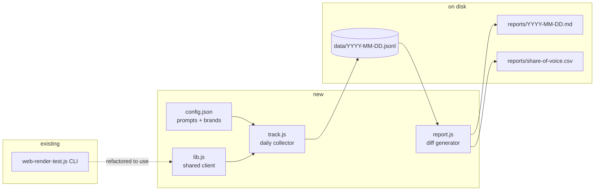

# Daily Brand-Visibility Tracker (Massive Web Render AI)

## Context

The repo today is a single CLI (`web-render-test.js`) that fans one prompt at one of {chatgpt, gemini, perplexity, copilot} through Massive's Web Render AI endpoint and prints the response. The product opportunity sitting on top of that endpoint is **GEO tracking** — asking the same category question across all four assistants on a daily cadence and watching which brands each model surfaces, in what order, and how that shifts over time. Massive's bundled cross-model access is what makes this tractable; you can't easily pull the same data any other way.

V1 ships three things: a shared client library, a daily collector, and a markdown diff report comparing today vs. the prior run. Out of scope for v1: LLM-written narrative summaries, web dashboard, plotting, multi-tenant config.

## Shape of the change



Refactor first (so the CLI keeps working), then build on top.

## Files

### `lib.js` (new)
Extract these from `web-render-test.js` verbatim, no behavior changes:
- `API_BASE` (line 17)
- `getApiToken` (lines 19-26)
- `fetchWithRetry` (lines 58-79)
- `fetchDevices` (lines 81-92)
- `makeAiRequest` (lines 94-128)

Export them via CommonJS (`module.exports = {...}`) — the existing file uses CommonJS-compatible syntax already and there's no `package.json` declaring `"type": "module"`.

### `web-render-test.js` (modify)
Replace the inlined helpers with `const { ... } = require('./lib.js')`. Keep `parseArgs` and `main` in place. CLI behavior must be byte-for-byte identical; verify with one smoke run.

### `config.json` (new)
Single source of truth for what's being tracked:
```json
{
  "models": ["chatgpt", "gemini", "perplexity", "copilot"],
  "prompts": [
    {
      "id": "ai-coding-tools",
      "text": "What are the best AI coding tools right now? List the top 10."
    }
  ],
  "brands": [
    { "name": "Cursor", "aliases": [] },
    { "name": "Claude Code", "aliases": ["Claude code CLI"] },
    { "name": "GitHub Copilot", "aliases": ["Copilot"] },
    { "name": "Cline", "aliases": [] },
    { "name": "Windsurf", "aliases": ["Codeium"] },
    { "name": "Aider", "aliases": [] },
    { "name": "Continue", "aliases": [] },
    { "name": "Tabnine", "aliases": [] }
  ]
}
```
Adding a new category = adding one prompt + relevant brands. No code changes.

### `track.js` (new)
For every `(prompt × model)` pair:
1. Call `makeAiRequest(token, { prompt: p.text, model: m, format: "json", expiration: "0" })` — `expiration: "0"` bypasses Massive's cache so we get a fresh response each day.
2. Pull the response text out of the returned JSON. The Web Render AI JSON shape isn't documented in this repo — first run should `console.log` the keys once so the implementer can pick the right field (likely `response` or `text`); pin it after the first call.
3. **Brand extraction**: for each brand, do a case-insensitive search of the response text for `name` and each `alias`; record the lowest first-character index found, or `null` if absent. Sort matched brands by `first_index` ascending and assign `rank` 1..N. Rationale: LLM "top N" responses mix prose, headers, bullets, and tables — first-mention index is a robust ordering signal that doesn't require a markdown parser.
4. Append one JSON line to `data/YYYY-MM-DD.jsonl` per `(prompt, model)` with: `{date, prompt_id, model, brands: [{name, rank, first_index}], response_text, raw_response}`.

Run all `(prompt × model)` calls concurrently with `Promise.allSettled` so one model failing doesn't kill the day. On failure, write a row with `error: "<message>"` and an empty `brands` array — the day's record is still complete.

Date format: UTC `YYYY-MM-DD` (`new Date().toISOString().slice(0, 10)`) so cron jobs in any timezone produce stable filenames.

### `report.js` (new)
1. Read the latest `data/*.jsonl` and the prior one (sort filenames lexicographically; stable because of the date format above).
2. For each `prompt_id`, emit:
   - **Per-model section**: today's ranked brand list, with `+new`, `-dropped`, and `↑/↓N` markers vs. the prior day.
   - **Cross-model consensus table**: for each brand, count how many of the four models mentioned it today; flag brands that gained/lost models since the prior day.
3. Write markdown to `reports/YYYY-MM-DD.md`.
4. Append rows to `reports/share-of-voice.csv` with columns `date,prompt_id,model,brand,rank,first_index`. CSV opens in any tool; no plotting library needed in v1.

If only one day of data exists, skip the diff sections and just print today's snapshot.

### `.gitignore` (new)
```
.env
node_modules/
```
Leave `data/` and `reports/` tracked — committing them turns the repo itself into the time series, which is the cheapest possible storage for v1.

### `README.md` (modify)
Append a "Daily tracker" section:
- `node track.js` — what it does, where it writes
- `node report.js` — what it produces
- One-line cron example: `0 9 * * * cd /path/to/repo && MASSIVE_API_TOKEN=... node track.js && node report.js`

## Reuse, not reinvention

Everything HTTP-related already exists in `web-render-test.js`. The retry/backoff in `fetchWithRetry` (lines 58-79) handles Massive's 503s — `track.js` gets that for free by calling `makeAiRequest`. Don't add a second HTTP layer.

No `package.json`, no dependencies. Native `fetch`, `fs/promises`, `path` are sufficient.

## Verification

1. `MASSIVE_API_TOKEN` is set in the shell.
2. `node web-render-test.js "test"` — confirms the lib.js refactor didn't break the CLI.
3. `node track.js` — expect `data/2026-05-01.jsonl` with 4 lines (one per model). Each line has a non-empty `brands` array (or an `error` field). Spot-check one line: do the matched brands and ranks roughly match what's in `response_text`? If a brand is clearly mentioned but missing, add aliases to `config.json` and re-run.
4. `node report.js` — with one day of data, should print today's snapshot to `reports/2026-05-01.md` without crashing on the missing prior day.
5. Run `track.js` again the next day (or fake a prior file by copying today's and tweaking one rank) and re-run `report.js` — diff sections should populate.

## Order of operations for the implementer

1. Create `lib.js`, refactor `web-render-test.js` to import from it, run the CLI smoke test.
2. Add `config.json` and `.gitignore`.
3. Build `track.js`, run it once, inspect output, fix the response-field name and any obvious alias gaps.
4. Build `report.js`, run with one day of data, then with two.
5. Update `README.md`.
6. Commit, open PR.
